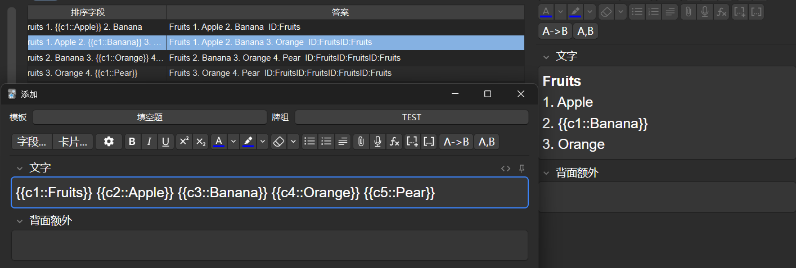
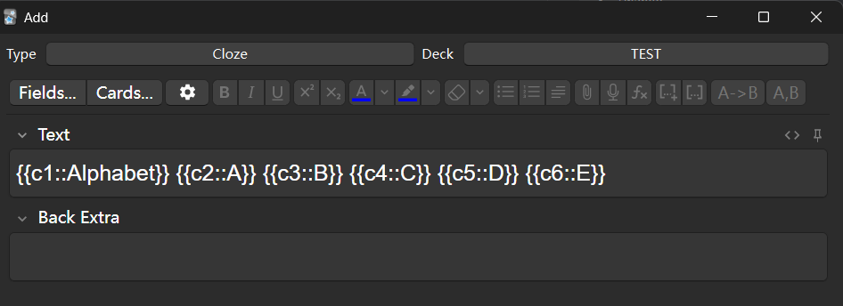
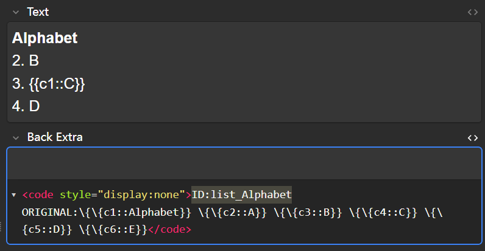

# Clozed List Builder for Anki

> 在此阅读[中文文档](/README_zh-cn.md)



# Warning: Read before proceeding
Please follow the tutorial exactly or you will probably run into errors. It's my first time making an addon so I don't know how to do certain stuff properly, but I will try to fix them later on.

# Introduction
When you are studying, you may need to memorise lists. This addon can help you quickly generate/convert the following types of lists into notes:

- **Item lists(e.g. Fruits: Apple, Banana, Orange)** Lists that require you to recall items based on its name, not necessarily ordered. Your note will look something like this:
```
FRUITS
1. Apple
2. [...]
3. Orange
```
- **Ordered Lists(e.g. Orders: Firstly -> Secondly -> Thirdly)** Lists that require you to recall an item based on the one before it, such as poems or instructions. Your note will look something like this:
```
ORDERS
Firstly -> [...]
```

# Adding
To add a list, you **must** use the default Cloze note type, which will come with `Text` and `Back Extra` fields. The addon will use the selected type to create notes.
> If you have altered the default type, you can add the default type by going to Tools -> Manage Note Types -> Add -> Add: Cloze.

> Your list will be added to **the selected deck on your home screen**, NOT the one selected in your add menu. Make sure you first click on the deck you want to add to. (to be fixed)

You can then enter each item of your list as a cloze, make sure the numbers do not repeat. **Your first cloze will become your title, which is displayed on all notes.** You can enter information on `Back Extra` as usual. 

Any text that isn't included in the cloze will be discarded.



If you wish to create a linked(ordered) list, click on `A->B`.

If you wish to create an item(unordered) list, click on `A,B`.

Once you click on either button, your list will be created and a file browser will pop up, showing lists with the same title.

> If you wish to add any more lists, you must close the Add window, then open it again. (to be fixed)
# Deleting/Searching
Due to the limitations on Anki's card templates, the addon will create your list as individual notes rather than cards. This means you will have to search for all notes from the same list.

The addon will add a hidden ID in your `Back Extra` field, which will not be shown while you are studying. The ID is your title with a `list_` prefix. 

To find it, select your note in the browser and click on the code icon next to Back Extra to reveal it. On mobile, you will be able to see it straight away.

You can then search for the ID (without `ID:`) to find all notes created from the same list.
# Editing
As mentioned earlier, due to limitations, you will have to delete all of the notes and recreate the list. The addon will provide a copy of what you originally entered in the hidden bit of the `Back Extra` field, so you can modify it again. You will have to remove slashes in an external editor. This process will be simplified in a future version of the addon.

# Using a custom note type
When you create a list, the addon will take all clozes from the first field and process them as lists, and then insert the hidden section in your second field. If your custom note type wont break from this, you could likely use the addon on it.