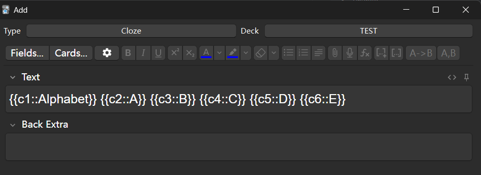

# Anki 列表转卡片插件


# 注意：请先完整阅读文档
由于这是作者第一次接触开发Anki的插件，有些地方尚有欠缺，未来会逐渐完善。请仔细按照文档操作，否则Anki很可能会崩溃。

# 简介
在您学习的时候，可能会需要记忆以下类型的知识点:

- **列表:** 知识点可能会需要记住多个项目，例如：
```
西红柿炒钢丝球的原料
1. 钢丝球
2. [...]
3. 洋葱
```
- **有序列表** 知识点需要按顺序记忆，比如说课文或者操作步骤：
```
西红柿炒钢丝球的步骤
准备钢丝球 -> [...]
```

# 创建笔记
添加列表时，您**必须**选择Anki默认的填空题模板，包含`文字`和`背面额外`两个字段。插件会使用您选择的模板来创建笔记。

> 如果您已经更改过了这些字段，可以通过工具 -> 管理笔记模板 -> 添加 -> 添加：填空题重新添加默认的填空题模板。

> 您的列表会被添加到您在首页上选择的牌组，而不是在添加页面里所选择的牌组。请先在首页上选择想添加的牌组，再输入列表。（待修复）

之后就可以输入列表的内容了。列表里的每一项物品都需要是一个填空，确保数字不能重复。列表的第一个填空将会作为标题，在每一张卡片上都会显示。

任何未包含在填空里的文字都会被忽略。



如果要创建一个普通列表，点按 `A,B`.

如果要创建一个有序列表，点按 `A->B`.

按下按钮后，插件会为您输入的列表创建笔记，然后在Anki的浏览器里面显示这些笔记。

> 如果还想要添加列表，需要先关闭添加窗口再打开。（待修复）
# 删除/搜索
由于Anki模板的限制，插件只能将列表创建为笔记，而不是卡片。如果要删除这些笔记，则需要在Anki的浏览器直接搜索，再全部删除。

插件会在创建笔记后在`背面额外`字段里插入一个隐式ID，带有`list_`前缀。ID在您学习时不会显示。

如果需要ID，首先在浏览里找到卡片，然后点按`背面额外`旁边的代码图标。手机版本可以直接看到这个ID。

之后，您就可以用这个ID搜索（不要包含`ID:`）来自同个列表的笔记了。
# 编辑
如前所述，由于Anki的限制，您需要将先前创建的列表删除，做出更改后再新建一个。插件会在`背面额外`提供您在创建列表时输入的内容，以便您以后可以做出更改。您在编辑时需要将反斜杠删除。作者会考虑在未来优化这个流程。

# 使用自己创建的笔记模板
在创建列表时，插件会读取您在第一个字段里的所有填空，再把它们当成列表处理，然后在第二个字段里插入ID和原内容。如果您的模板不会受此操作影响，则可以和插件一起使用。